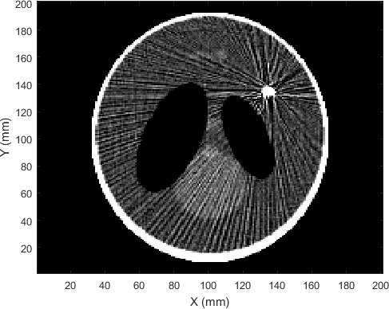
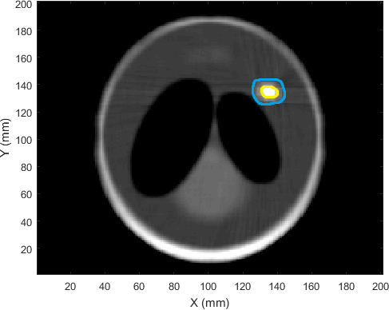

# metal_artifact_reduction_ct

This was a group project for a graduate course in biomedical signal processing. [Report pdf](https://github.com/mattgoh/metal_artifact_reduction_ct/raw/main/EECE_5664_Final_Project_Report.pdf)

## Background
Briefly, x-ray computed tomography (CT) measures the x-ray attenuation along a line between an x-ray source and an x-ray detector. In contrast to conventional x-ray imaging, the source and detector mechanism in CT is motorized and rotates around a circular opening within a donut-shaped structure called a gantry.  It is generally assumed that the only physical interaction between the X-ray beam and the object under test (OUT) is absorption. This results in linear basis functions called lines-of-response which are convenient for the mathematics which underlie CT reconstruction. In most cases, the scattering effects of the X-ray beam are negligible and this approximation is valid. However, if there is metal present in the OUT, the scattered response is relatively strong. In this case, the conventional assumptions will result in images with so-called "star-artifacts". These image anomalies are referred to as artifacts because they are not representative of an actual object, but a mismatch between the assumed and the actual physical interactions in the system.

Reduction of these artifacts has been the topic of much effort in the field of medical imaging. If an effective algorithm can be designed to remove these star artifacts, the quality of medical images can be dramatically improved for cases in which the OUT includes metal. Specifically, this would allow for improved CT scans in patients with metal pins, clips, splints, shrapnel/bullets, or implanted medical devices.

The aim of this project was to study and compare several metal artifact reduction methods:

1. sinogram interpolation

2. gradient descent with image segmentation.

## Results

Original image

Filtered Image

Filtered and segmented

